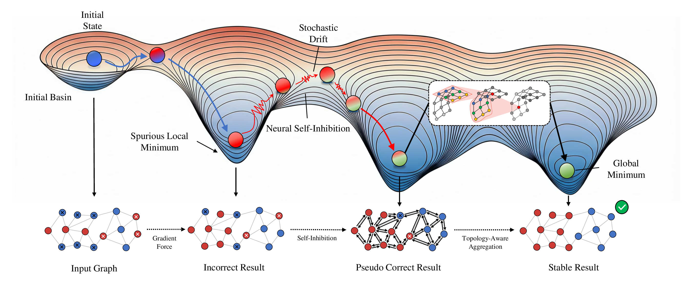

# CDAT: Controlled Dynamics Attractor Transformer

This repository contains the official implementations of **Controlled Dynamics Attractor Transformer (CDAT)**, a novel Transformer architecture that combines associative memory modeling with continuous controlled dynamics. CDAT features a tractable energy function whose iterative refinement is guaranteed to converge to a fixed point, providing a stable and theoretically grounded backbone for graph learning.

The project is organized as a monorepo with two sub-projects, each targeting a different downstream task:

| Sub-project | Task | Framework | Folder |
| --- | --- | --- | --- |
| **CDAT for Graph Anomaly Detection** | Node-level anomaly detection on large graphs | PyTorch + DGL | [`cdat-for-graph-anomaly-detection/`](cdat-for-graph-anomaly-detection/) |
| **CDAT for Graph Classification** | Graph-level / image-as-graph classification | JAX + Flax + PyG | [`cdat-for-graph-classification/`](cdat-for-graph-classification/) |

## Overview

<p align="center">
  
</p>

CDAT introduces controlled dynamics and attractor mechanisms into the graph Transformer family. Rather than computing attention in a single forward pass, CDAT iteratively refines node representations via a controlled dynamical system whose suppression term drives the trajectory toward an energy minimum. This yields two concrete benefits:

- **Stability and convergence**: The energy formulation guarantees a fixed-point attractor, making deep iterative blocks robust to noise and over-smoothing.
- **Expressive graph attention**: Multi-head attention is combined with low-rank / Hopfield-style associative memory, enabling rich structural reasoning while remaining computationally tractable.

## Features

- **Controlled Dynamics**: Energy-guided iterative refinement with a suppression term that drives convergence to a fixed point.
- **Attractor-based Attention**: Hopfield-style associative memory layered on top of multi-head graph attention.
- **Two Backends**: A PyTorch + DGL implementation for large-graph anomaly detection, and a JAX + Flax implementation for graph classification.
- **Multiple Dataset Support**: Out-of-the-box support for T-Finance, T-Social, Yelp, Amazon, TUDataset (MUTAG, PROTEINS, ...), and GNNBenchmark (CIFAR10, ...).

## Repository Structure

```
.
├── cdat-for-graph-anomaly-detection/   # PyTorch + DGL implementation for anomaly detection
│   ├── train.py                        # Main training script
│   ├── cdat.py                         # CDAT network (GraphTransformerNet)
│   ├── graph_transformer_layer.py      # Graph Transformer attention layer
│   └── dataset.py                      # Dataset loading utilities
│
├── cdat-for-graph-classification/      # JAX + Flax implementation for classification
│   ├── src/
│   │   ├── model/
│   │   │   ├── core.py                 # CDATLayerNorm, HopfieldTransformer
│   │   │   ├── cdat.py                 # GraphCDAT for graph classification
│   │   │   └── cdat_img.py             # GraphImageCDAT for image-as-graph
│   │   └── graph_utils/                # Training / evaluation helpers
│   └── examples/
│       ├── simple_example.py           # MUTAG / PROTEINS minimal example
│       └── image_example.py            # CIFAR10 minimal example
│
├── README.md                           # This file
├── requirements.txt                    # Combined dependencies for both sub-projects
├── LICENSE                             # MIT License
└── .gitignore
```

## Installation

The two sub-projects use different deep-learning stacks (PyTorch + DGL vs. JAX + Flax). Install only the stack you need, or install everything via the unified `requirements.txt`.

### Prerequisites

- Python >= 3.8
- CUDA-capable GPU (recommended)

### Install all dependencies

```bash
pip install -r requirements.txt
```

Then, depending on the sub-project you intend to run:

```bash
# For graph classification (JAX backend), enable GPU support for JAX
pip install --upgrade "jax[cuda]" -f https://storage.googleapis.com/jax-releases/jax_cuda_releases.html
```

**Notes**:
- For DGL installation with CUDA support, please refer to the [DGL installation guide](https://www.dgl.ai/pages/start.html).
- For JAX-CUDA versions, please refer to the [JAX installation guide](https://github.com/google/jax) and the [JAX-CUDA release page](https://storage.googleapis.com/jax-releases/jax_cuda_releases.html).

### Verify JAX GPU support

```python
import jax
print(jax.local_devices())
```

## Quick Start

### Graph Anomaly Detection

Train CDAT on the Amazon dataset with subgraph sampling:

```bash
cd cdat-for-graph-anomaly-detection
python train.py --dataset amazon --train_ratio 0.4 --hid_dim 128 --num_heads 2 \
                --n_layers 2 --epoch 300 --run 5 --layer_norm True --residual True --seed 10
```

Other supported datasets: `yelp`, `tfinance`, `tsocial`. See the sub-project for the full list of command-line arguments (`--alpha`, `--suppression_coef`, `--noise_std`, ...).

#### Dataset Preparation

- **T-Finance / T-Social**: Download from [Google Drive](https://drive.google.com/drive/folders/1PpNwvZx_YRSCDiHaBUmRIS3x1rZR7fMr?usp=sharing) and place under `cdat-for-graph-anomaly-detection/dataset/{tfinance,tsocial}/`.
- **Yelp / Amazon**: Auto-downloaded on first run.

### Graph Classification

Minimal working example with MUTAG:

```bash
cd cdat-for-graph-classification
python examples/simple_example.py
```

CIFAR10 (image-as-graph) example:

```bash
cd cdat-for-graph-classification
python examples/image_example.py
```

Programmatic usage:

```python
import jax
import jax.numpy as jnp
from torch_geometric.loader import DataLoader
from torch_geometric.datasets import TUDataset
from src import GraphCDAT, init_model

train_data = TUDataset(root='./data', name='MUTAG', use_node_attr=True)

model = GraphCDAT(
    embed_dim=128, out_dim=2, nheads=4, alpha=0.1, depth=2, block=2,
    head_dim=64, multiplier=4.0, num_tokens=500, dtype=jnp.float32,
    kernel_size=[3, 3], kernel_dilation=[1, 1],
    compute_corr=True, vary_noise=False, chn_atype='relu',
)

key = jax.random.PRNGKey(42)
params = init_model(DataLoader(train_data, batch_size=1), key, model,
                    k=15, embed_type='eigen', task_level='graph')
```

For image classification (GNNBenchmarkDataset), use `GraphImageCDAT` with a smaller `alpha` (default `0.01`) — pixels are converted to graph nodes.

## Model Architecture

CDAT shares the same core ideas across both sub-projects:

1. **Input Embedding** — Linear projection of node features to the hidden dimension.
2. **Graph Transformer / Hopfield Layers** — Multi-head attention augmented with associative-memory readout.
3. **Controlled Dynamics Iteration** — Iterative refinement governed by an energy function and a suppression coefficient.
4. **Low-rank Approximation** — Efficient long-range interaction via low-rank attractor matrices.
5. **Output Head** — Task-specific MLP (anomaly classification or graph/image classification).


## License

This project is released under the MIT License — see [LICENSE](LICENSE) for details.
